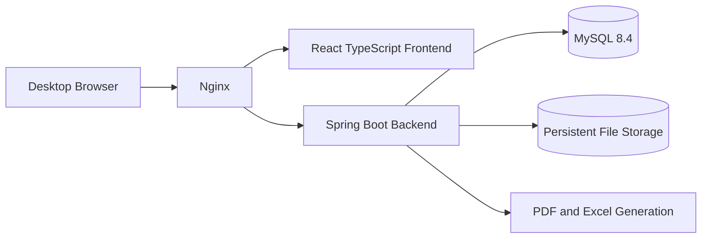
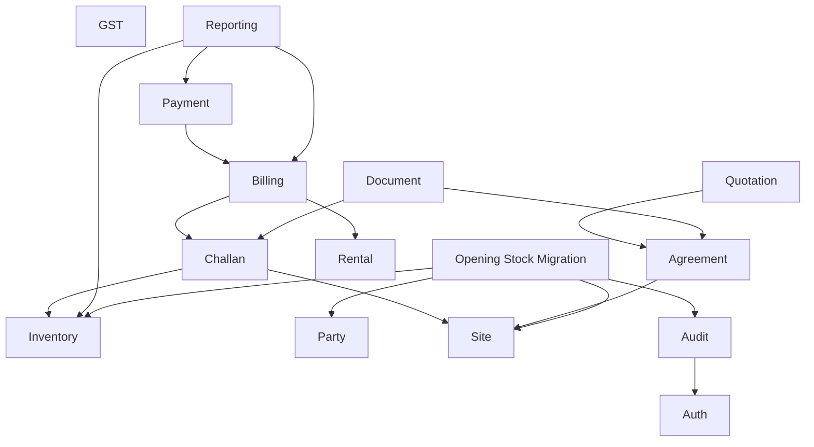

# 4. System Architecture

## Phase 5A quotation architecture

The quotation module owns templates, aggregates, transitions and snapshots. `common.numbering` allocates document numbers. The calculation service is authoritative. PDF rendering uses Thymeleaf and OpenHTMLtoPDF against stored snapshots, not mutable item names.

## 4.1 Architecture Decision

Use a modular monolith.

The application will contain multiple business modules in one Spring Boot deployment and one MySQL database.

## 4.2 High-Level Architecture



## 4.3 Deployment Units

- Frontend container
- Backend container
- MySQL container
- Optional backup container or host cron job

## 4.4 Internal Backend Modules



## 4.5 Module Boundary Rules

1. Each module owns its business logic.
2. Only the inventory module updates stock balances.
3. Only the payment module records payments.
4. Only the billing module creates invoices.
5. Reporting is primarily read-only.
6. Modules communicate through public service interfaces.
7. Controllers do not call repositories directly.
8. Entities are not exposed through REST APIs.
9. Cross-module database writes must be coordinated through services.
10. Shared code belongs in `common` only when genuinely generic.

## 4.6 Why Not Microservices

Microservices are not appropriate initially because:

- Only about three users
- One client
- One server
- One development team
- Strong transaction coupling
- No independent scaling
- No separate release cadence
- No operational team for distributed systems

A single issued challan may require:

- Agreement validation
- Order validation
- Stock validation
- Challan creation
- Stock reduction
- Pending quantity update
- Audit logging

A monolith can complete this in one database transaction.

## 4.7 Future Extraction Candidates

Only extract services when a real need appears.

Possible future services:

- Document processing service
- OCR or AI agreement service
- GST and E-Way Bill integration service
- Notification service
- Heavy report generation worker

Core inventory, site, challan, and billing logic should remain together as long as they share transactional boundaries.

### 4.7.1 Opening Stock Migration Boundary

`com.stocksync.migration` owns workbook storage metadata, controlled parsing, staging rows,
mapping state, validation, reconciliation, and import reports. It communicates through public
interfaces with the Item, Party/Site, and Inventory modules.

The migration module never updates `stock_balances` directly. It submits opening commands to the
Inventory module, which locks balance rows, appends immutable stock transactions, and updates the
projection in the same transaction. Posting locks the import batch pessimistically and processes
items in stable item-ID order, preventing concurrent duplicate posting and reducing deadlock risk.

Reversal locks the batch and affected balances, rejects later stock movements, then appends
compensating ledger transactions. Original opening transactions and staging evidence remain
unchanged.

## 4.8 Transaction Strategy

Use `@Transactional` for business operations that change multiple records.

Examples:

- Post issued challan
- Post receiving challan
- Record stock purchase
- Record scrap
- Generate invoice
- Allocate payment
- Transfer material between sites

## 4.9 Concurrency Strategy

Use one or more of:

- Optimistic locking with `@Version`
- Pessimistic row locking for critical stock rows
- Unique constraints
- Idempotency keys for posting operations

The system must prevent two users from issuing the same available stock simultaneously.

## 4.10 Internal Events

Spring application events may be used for secondary actions:

- Audit entry
- Cache refresh
- Notification preparation
- Report refresh

Do not use asynchronous events for critical stock or financial consistency in the first version.

## 4.11 Error Handling

Use a global exception handler and standard API errors.

Example:

```json
{
  "timestamp": "2026-07-25T18:30:00Z",
  "status": 400,
  "code": "INSUFFICIENT_STOCK",
  "message": "Available quantity is lower than requested issue quantity",
  "fieldErrors": []
}
```
