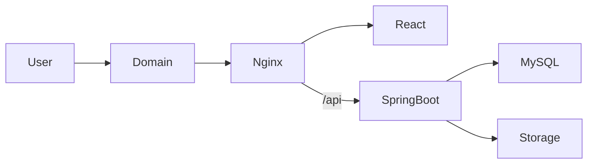

# 11. Deployment and DevOps

## 11.1 Supported Server

Recommended:

- Ubuntu 22.04 or 24.04
- VPS or dedicated server
- SSH access
- sudo or root permission
- 2–4 GB RAM minimum
- Adequate disk for uploads and backups

Docker Compose may not be available on ordinary shared cPanel hosting.

## 11.2 Production Services

```text
frontend
backend
mysql
```

Optional:

```text
backup
```

## 11.3 Network Flow



## 11.4 Compose Principles

- Use `restart: unless-stopped`.
- Do not expose MySQL publicly.
- Use named volume for MySQL.
- Use bind mount or volume for uploaded files.
- Use `.env` for configuration.
- Never commit secrets.
- Add health checks.
- Use production profiles.
- Pin major image versions.

## 11.5 Environment Variables

Examples:

```text
SPRING_PROFILES_ACTIVE=prod
DB_HOST=mysql
DB_PORT=3306
DB_NAME=shuttering_inventory
DB_USER=inventory_user
DB_PASSWORD=...
FILE_STORAGE_PATH=/app/storage
SESSION_COOKIE_SECURE=true
```

## 11.6 Reverse Proxy

Nginx responsibilities:

- Serve React build
- Proxy `/api`
- Terminate HTTPS or forward from an external proxy
- Set upload size limit
- Add security headers
- Support SPA fallback

## 11.7 Deployment Commands

```bash
docker compose build
docker compose up -d
docker compose ps
docker compose logs -f backend
```

Update:

```bash
git pull
docker compose build
docker compose up -d
```

## 11.8 Database Migrations

Flyway migrations run during backend startup.

Rules:

- Never edit an applied migration.
- Add a new migration.
- Back up before destructive migrations.
- Test migrations against production-like data.

## 11.9 Monitoring

Initial monitoring:

- Docker container status
- Spring Boot Actuator health
- Disk usage
- MySQL health
- Backup success
- Application error logs

## 11.10 HTTPS

Use:

- Let's Encrypt
- Certbot
- Caddy
- Existing reverse proxy
- Cloudflare, if client uses it

Production must use HTTPS before real business data is entered.

## 11.11 Minimum Production Checklist

- Domain configured
- HTTPS working
- Strong database passwords
- MySQL not public
- Upload storage mounted
- Database volume mounted
- Backup job tested
- Restore tested
- Admin password changed
- Logs rotating
- Server firewall configured
